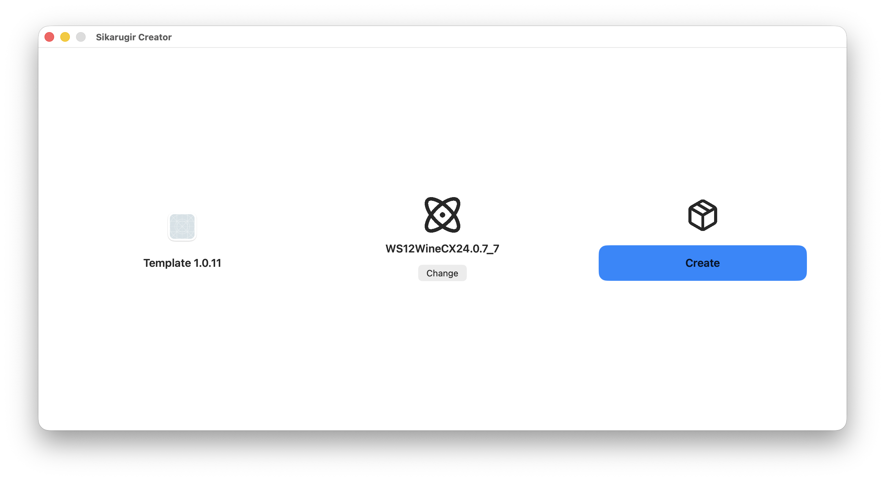
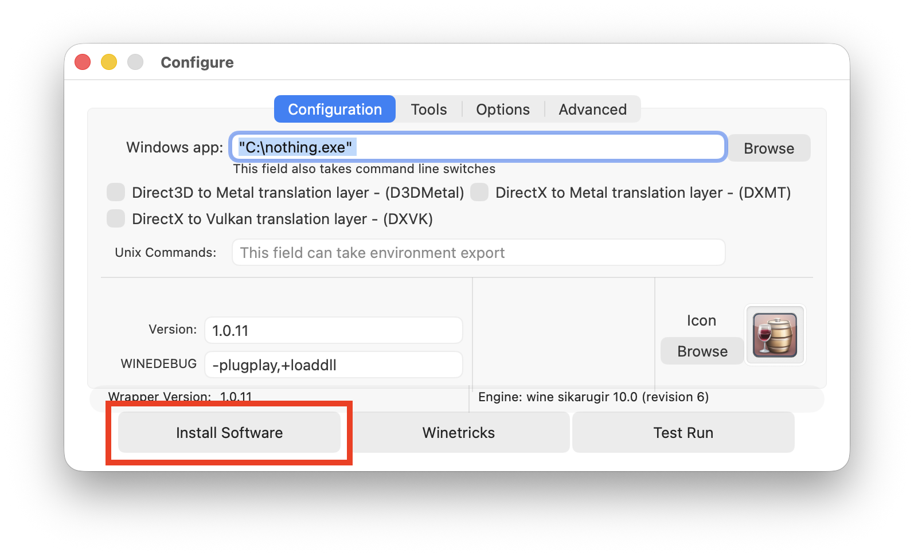
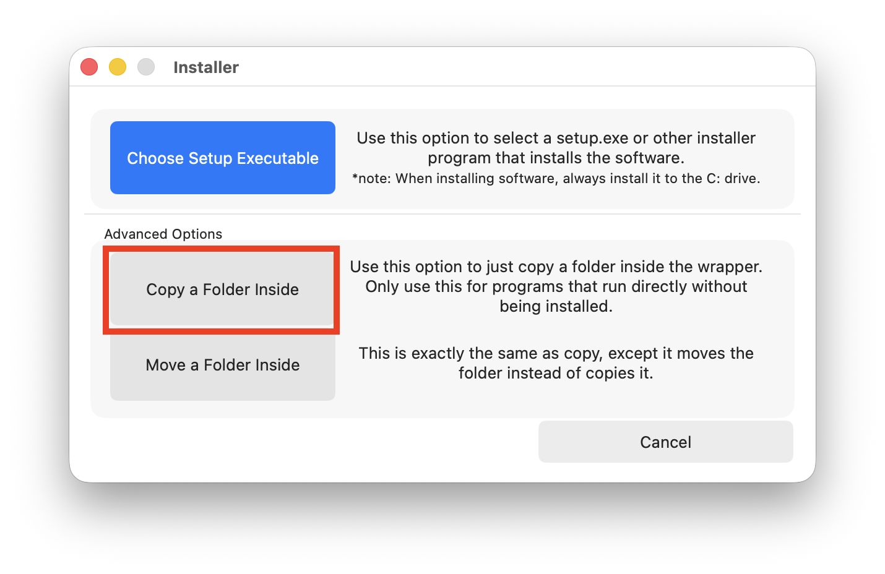
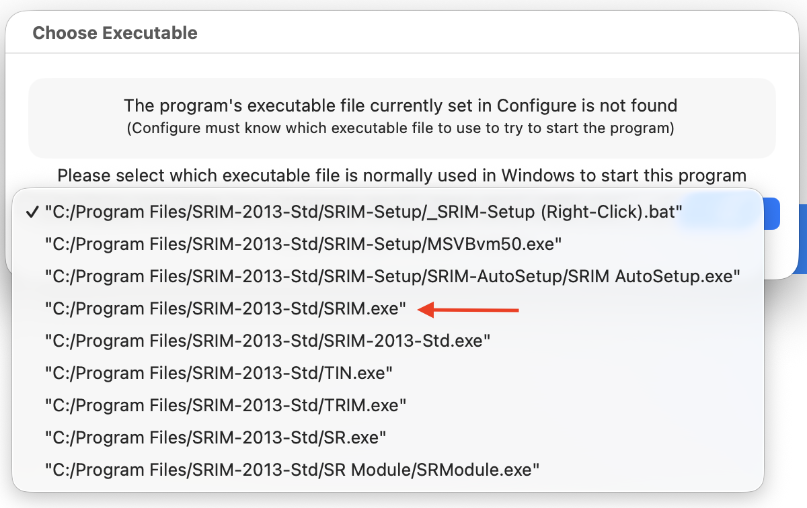
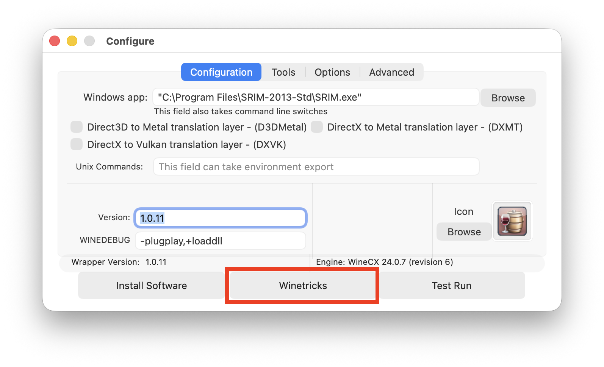
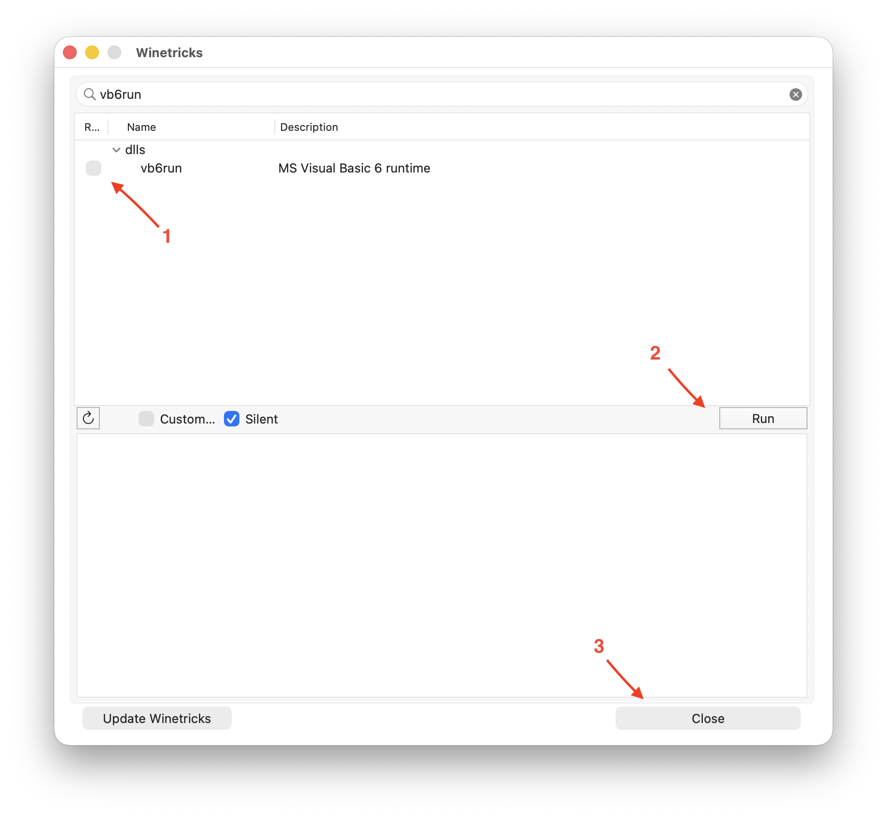

# SRIM 2013 on macOS Apple Silicon

**English** | [Italiano](./README.it.md)

Practical guide to run **SRIM 2013** on Macs with **M-series** chips (M1/M2/M3/M4/M5).

Verified setup:
- **Sikarugir** (Template `1.0.11`)
- Engine **WS12WineCX24.0.7_7**
- macOS on Apple Silicon (ARM64)

## Goal
Run SRIM 2013 reliably on Apple Silicon using a 32-bit Wine wrapper.

## Requirements
- macOS (Apple Silicon)
- Sikarugir (1.0.11)
- Engine: `WS12WineCX24.0.7_7`
- Rosetta 2

> [!NOTE]
> Install Sikarugir via [Homebrew](https://brew.sh/):
>
> ```bash
> brew upgrade
> brew install --cask Sikarugir-App/sikarugir/sikarugir
> ```
>
> Install Rosetta 2:
>
> ```bash
> /usr/sbin/softwareupdate --install-rosetta --agree-to-license
> ```

## Clone the repository

```bash
git clone https://github.com/tuo-username/nome-repo.git
cd nome-repo
```

## Decimal format setting
SRIM does not handle comma decimal separators correctly.

1. Open **System Settings**.
2. Go to **General > Language & Region**.
3. Set number format so the decimal separator is `.` (dot).

Correct example: `1,234,567.89` or `1 234 567.89`

## Step-by-step installation

### 0) Download SRIM
📥 [Download here](https://github.com/zosojack/SRIM-2013-Mac-Silicon/releases/latest/download/SRIM-2013-Std.zip) the .zip file, then go to the Downloads folder and extract it by double-clicking.

### 1) Create the wrapper
1. Open **Sikarugir Creator**.
2. Click **Download Template**.
3. Under "No engine selected", click **Change** and select engine `WS12WineCX24.0.7_7`.
4. Click **Create** and save the app (for example `SRIM-2013`) in `/Applications/sikarugir/` (default).
5. When prompted that the app was created, click **Launch it**.



### 2) Import SRIM
1. In the **Configure** panel, click **Install Software > Copy a Folder Inside**.
2. Select the `SRIM-2013-Std` folder included in this repository.
3. Set executable path to:

```text
C:/Program Files/SRIM-2013-Std/SRIM.exe
```

<div align="center">
	<table>
		<tr>
			<td align="center">
				
				<br>
				<em>1. Install Software</em>
			</td>
			<td align="center">
				
				<br>
				<em>2. Copy a Folder Inside</em>
			</td>
			<td align="center">
				
				<br>
				<em>3. Select executable</em>
			</td>
		</tr>
	</table>
</div>

### 3) Run SRIM internal setup
At the top, select **Tools** then click **Command Line (cmd)**. In the terminal window, type _manually_:

```bat
cd "C:\Program Files\SRIM-2013-Std\SRIM-Setup"
```

Press Enter, then run:

```bat
"_SRIM-Setup (Right-Click).bat"
```

When you see `END of SRIM setup`, close the terminal.

### 4) Install additional libraries
Go back to the **Configure** panel and click **Winetricks** at the bottom. In the window that opens, search for `vb6run`, tick it, then click **Run**. When done, click **Close**.

<div align="center">
	<table>
		<tr>
			<td align="center">
				
				<br>
				<em>1. Winetricks</em>
			</td>
			<td align="center">
				
				<br>
				<em>2. Enable vb6run and run</em>
			</td>
		</tr>
	</table>
</div>

### 5) Test Run
Click **Test Run** in the configuration panel to launch SRIM. If everything works, you can close the configuration panel. From now on, you can launch SRIM-2013 like a normal app.

## Troubleshooting
- If the interface looks too small:
	- go to **Tools > Wine Config > Graphics**
	- set DPI to `120`

## Credits
Inspired by the [original repository](https://github.com/antonio-padalino/SRIM-on-Mac) by Antonio Padalino and updated for Apple Silicon/Sikarugir.
